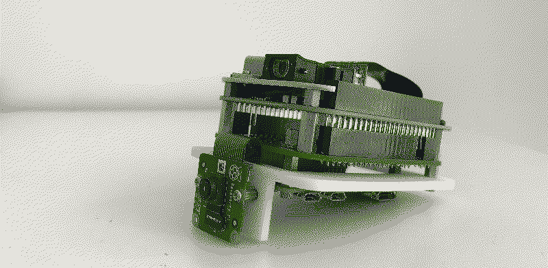
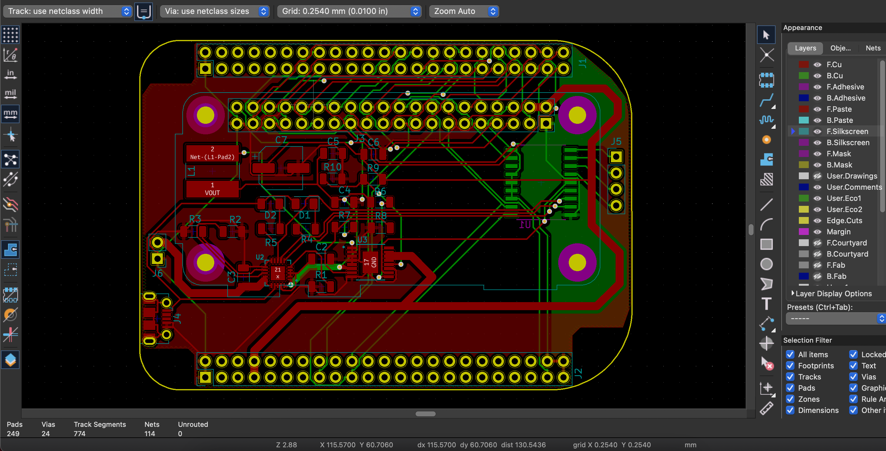

## About

A Mixed-Reality device using the small yet powerful RPI Zero 2W。It detect fiducials (aruco-markers) via the RPI dedicated camera and plays 720p resolution videos when detected. All of this running simulataneously on the PI Zero2W.This device gives a unique way to interact with static content as opposed to viewing it from screens which can be bulky and expensive to setup. This experience could also make way for interactive games and other kind of explorative projects.

I've compiled this project in Openframeworks (OFv0.10.0). It was difficult to link the libraries, especially to compile ofxOMXPlayer and ofxOMXCamera. So, ill provide a detailed guide for the right environment and setup instructions. This project greatly relies on the work done by [jvcleave](https://github.com/jvcleave/ofxOMXCamera) for building the OMX wrapper inside openframeworks. 

## Instructions 
Before downloading the source files, make sure you have your environment setup:
RPI Buster 5.10.17 armv7l
OFv0.10.0

Then download the dependent libraries which are:
ofxAruco
ofxCv
ofxOpenCv
ofxPoco
ofxOMXCamera
ofxOMXPlayer

Before compiling, you would need to make certain changes in your config file located in:
libs/openFrameworksCompiled/project/linuxarmv6l/config.linuxarmv6l.default.mk

Comment out: USE_GLFW_WINDOW = 1 AND USE_PI_LEGACY = 0

And then Add PROJECT_LDFLAGS += -latomic to file: config.make for your project to compile.

## KiCAD PCB

This PCB builds upon the work done by [mickmakes](https://github.com/MickMake/Project-PiProjector). It uses a simple charging circuit, along with outputs to detect the battery health and other charging paramters. I've also uploaded the BOM for sourcing the components. However some components like the MCP23008, TPS61030PWP & MCP73871 are not mentioned, since due to chip shortage these need to be sourced from other local Chinese vendors on [Taobao](http://taobao.com). Otherwise they are easily available on Mouser or Digikey. 
I will mention detailed steps for assembling and starting the device as soon as things get better here in Shanghai :D

